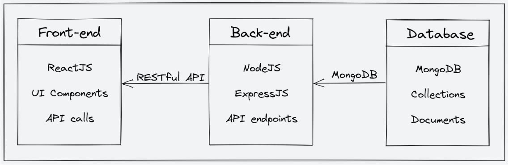
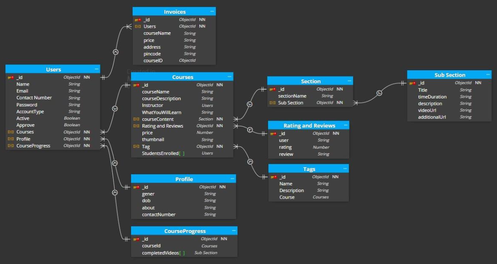
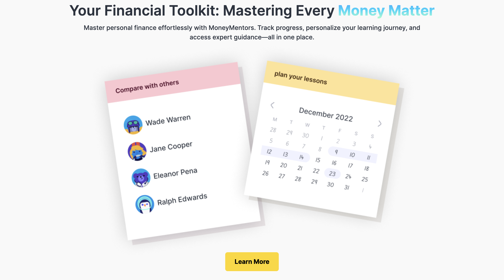
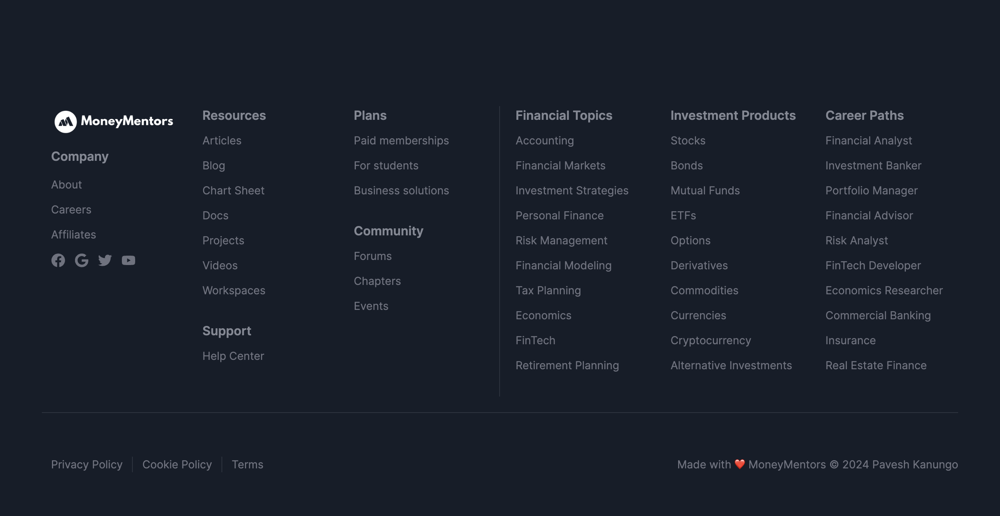

# 💸 MoneyMentors: Your Empowering Finance Study Platform

**MoneyMentors** is a MERN-stack based ed-tech platform built to empower individuals with financial literacy in a simplified, structured, and affordable way.

---

## 🧠 Problem Statement

Many people, especially students, struggle to understand financial concepts due to:
- Complex terminologies.
- High cost of quality resources.
- Low financial literacy (Only 27% of Indians possess basic financial knowledge).

**MoneyMentors** addresses this gap by providing an affordable, easy-to-understand, interactive financial education platform.

---

## 🚀 Description

MoneyMentors offers:
- 🎓 A seamless and engaging learning experience.
- 🧑‍🏫 A platform for instructors to share knowledge globally.

Built with the **MERN Stack**:
- MongoDB
- Express.js
- React.js
- Node.js

---

## 🏗️ System Architecture

MoneyMentors follows a **client-server** architecture:

### Components:
1. **Frontend:** React.js (UI and interaction)
2. **Backend:** Node.js + Express.js (API and server logic)
3. **Database:** MongoDB (NoSQL flexible storage)

### Architecture Diagram:
> 

---

## 🖥️ Frontend

### 👨‍🎓 Student Pages:
- **Homepage**
- **Course List**
- **Wishlist**
- **Cart Checkout**
- **Course Content**
- **User Details / Edit**

### 👨‍🏫 Instructor Pages:
- **Dashboard**
- **Insights**
- **Course Management**
- **Profile Edit**

### 👩‍💼 Admin Pages (Future Scope):
- **Dashboard**
- **Platform Insights**
- **Instructor & Course Management**

---

## 🛠️ Backend

### ✅ Architecture:
- Built using **monolithic** structure.
- Technologies: `Node.js`, `Express.js`, `MongoDB`

### 🔒 Core Features:
1. **Authentication & Authorization** (JWT + OTP)
2. **Course Management**
3. **Payment Integration** (Razorpay)
4. **Media Storage** (Cloudinary)
5. **Markdown Rendering** (for documents)

### 📦 Tools & Libraries:
- `Node.js`, `Express.js`, `MongoDB`, `Mongoose`
- `JWT`, `Bcrypt`, `Cloudinary SDK`, `dotenv`

### 🗃️ Data Models:
- **Student**
- **Instructor**
- **Course**

### Schema:
> 

---

## 📡 API Design

### 🌐 RESTful API Endpoints

| Method | Endpoint                        | Description                           |
|--------|----------------------------------|---------------------------------------|
| POST   | /api/auth/signup                | Register a user                       |
| POST   | /api/auth/login                 | Log in and receive JWT                |
| POST   | /api/auth/verify-otp           | OTP verification                      |
| POST   | /api/auth/forgot-password      | Send password reset email             |
| GET    | /api/courses                   | Get all courses                       |
| GET    | /api/courses/:id               | Get course by ID                      |
| POST   | /api/courses                   | Create new course                     |
| PUT    | /api/courses/:id               | Update course                         |
| DELETE | /api/courses/:id               | Delete course                         |
| POST   | /api/courses/:id/rate          | Rate a course                         |

---

## 🚀 Deployment

| Component     | Service     |
|---------------|-------------|
| **Frontend**  | Vercel      |
| **Backend**   | Render      |
| **Media**     | Cloudinary  |
| **Database**  | MongoDB Atlas |

> ✅ All components are cloud-hosted for scalability and performance.

---

## 🔍 Testing

Testing includes:
- **Unit Testing** for core components and services.
- **Integration Testing** for APIs.
- Tools like `Jest` or `Mocha` (TBD in implementation phase).

---

## 🧩 Future Enhancements

| Feature                                 | Priority      |
|----------------------------------------|---------------|
| Personalized Learning Paths            | ⭐ High        |
| Gamification (Badges, Points)          | ⭐⭐ Medium     |
| Social Learning (Groups, Peer Review)  | ⭐⭐ Medium     |
| Mobile App                             | ⭐ High        |
| ML-Based Recommendations               | ⭐⭐ High       |
| AR/VR Integration                      | ⭐⭐ Low        |

---

## 🖼️ Screenshots

> 
> 
> 
> 
> 
> 
> 

---

## 🏁 Run Locally

```bash
# Clone the project
git clone https://github.com/paveshkanungo/MoneyMentors.git

# Go to the project directory
cd MoneyMentors

# Install frontend dependencies
npm install

# Navigate to the server folder and install dependencies
cd server
npm install

# Start backend server
npm start

# Start frontend server
npm run dev

```

---

## 🔐 Environment Variables

To run this project locally, you need to set up environment variables in two places:

### 📁 Root `.env` file

Create a `.env` file in the root folder of your project and add the following:

```env
RAZORPAY_KEY=your_razorpay_key
REACT_APP_BASE_URL=http://localhost:<your_port>/api/v1
```

### 📁 Server `.env` file

Navigate to the server folder, create a .env file there, and add the following:

```env
MAIL_HOST=your_mail_host
MAIL_USER=your_email@example.com
MAIL_PASS=your_email_password
JWT_SECRET=your_jwt_secret
FOLDER_NAME=your_folder_name
RAZORPAY_KEY=your_razorpay_key
RAZORPAY_SECRET=your_razorpay_secret
CLOUD_NAME=your_cloudinary_cloud_name
API_KEY=your_cloudinary_api_key
API_SECRET=your_cloudinary_api_secret
MONGODB_URL=your_mongodb_connection_string
PORT=your_backend_port
```

Replace all placeholder values (e.g., your_mail_host, your_razorpay_key, etc.) with your actual configuration values.

---